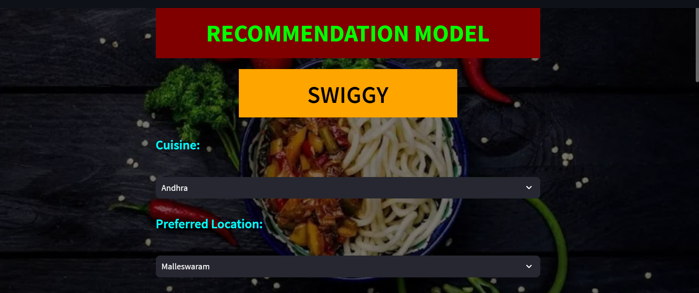
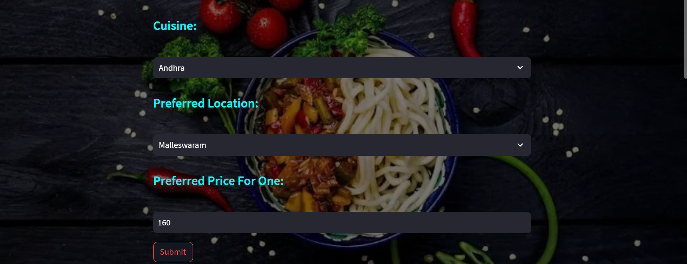
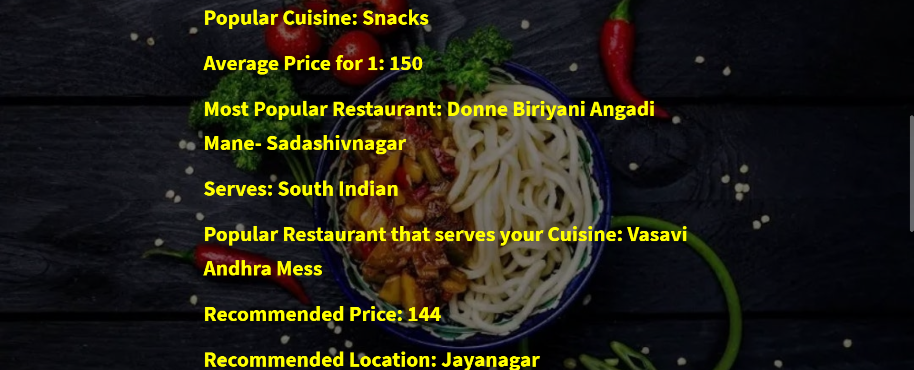
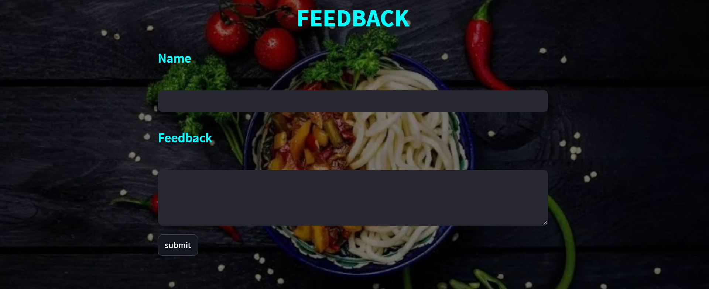

# Swiggy Recommendation Model
** Swiggy is an Indian online food ordering and delivery platform founded in 2014. Its headquarter is located in Bangalore and operates in more than 500 Indian cities. **

#  **User's Manual**

| Files| Description |
| -------------   | ------------- |
| **Swiggy Web Scraping**  | This folder contains the ipynb code of the Web scrapping.  |
| **Swiggy Data** | This file contains the  scraped data in Excel format. |
| **Data Cleaning & Model.ipynb**  | This folder contains the ipynb code of the Data cleaning & determining model performance.  |
| **Swiggy Cleaned Data csv**  | This file contains the  cleaned data in CSV format. |
| **Swiggy.py**  | This folder contains the code for making the webpage that is both backend and frontend.  |
| **Swiggy recommendation model ppt**  | This file contains the presentation on this project using PowerPoint.  |

 

#  Quick Start

1 **Data Scraping**: Used Python with libraries like Selenium and BeautifulSoup to scrape data from the Swiggy website. The scraped data was then saved in a structured format.

2 **Data Cleaning and Preprocessing**: Performed data cleaning and preprocessing using Python's data manipulation libraries, such as NumPy and Pandas. This step involved handling missing values, correcting data inconsistencies, and ensuring the data is in a clean and usable form.

3 **ML Performance Matrix**: Used Skikit libraries in Python to evaluate the performance of the model and get the best-fitted model for prediction.

4 **Web page Creation**: Created an interactive web page in Python, using the transformed data, to visualize various outputs. The Webpage will provide ideas about the restaurants and cuisines the restaurants are offering.
    
 

# INPUT

.
.

# FINDINGS

.

# FEEDBACK

 
 

 #   Limitations and Future Work
   
1 Not enough data about users or items, making it difficult to give accurate recommendations.

   o Alternative data sources 

2 Struggle with updates in real-time, like new user preferences or changing item availability.

   o Adapt and update recommendations in real time.

3 Handle sensitive user data, so we need to prioritize privacy.

   o Privacy-preserving techniques

4 Not enough information about certain items, especially those that are not popular or niche. 

   o Fill missing values by analyzing patterns in user-item interactions to estimate the unknown values.

5 Make recommendations more understandable and transparent.

   o Build trust and understanding and take user feedback into account.

6 Better ways to measure recommendation system performance.

   o Explore new evaluation metrics that consider user satisfaction, diversity, or long-term engagement

